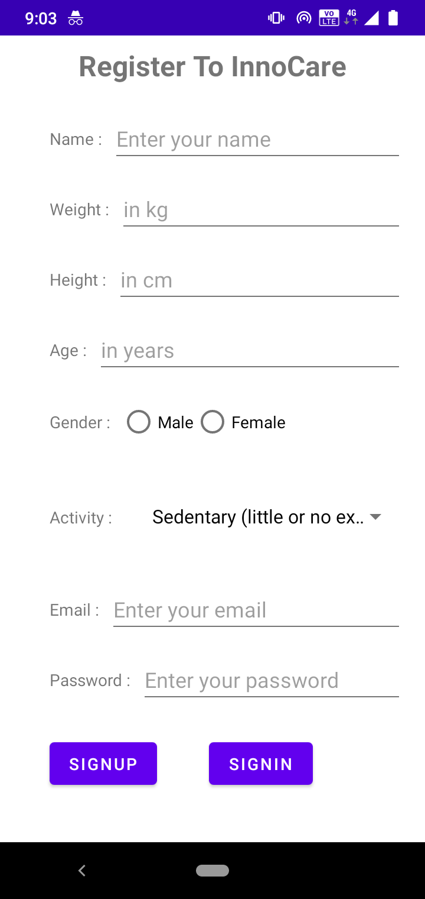
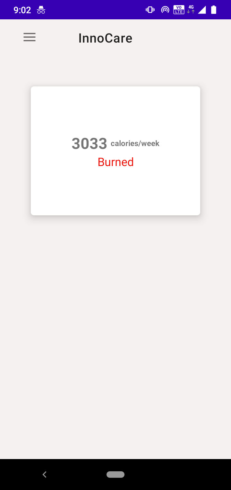
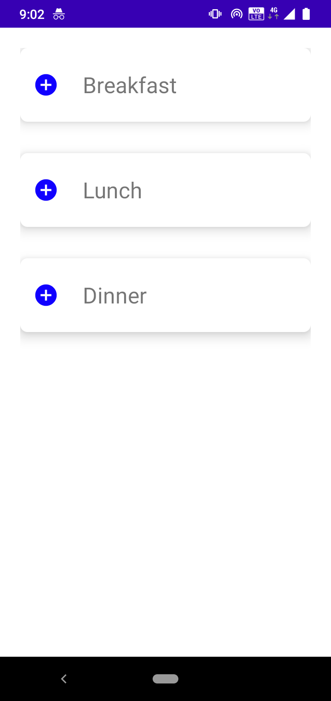
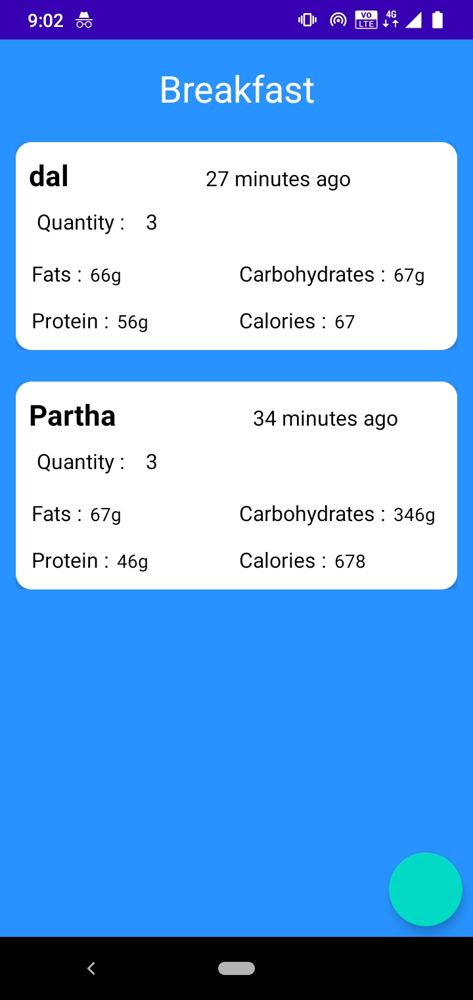
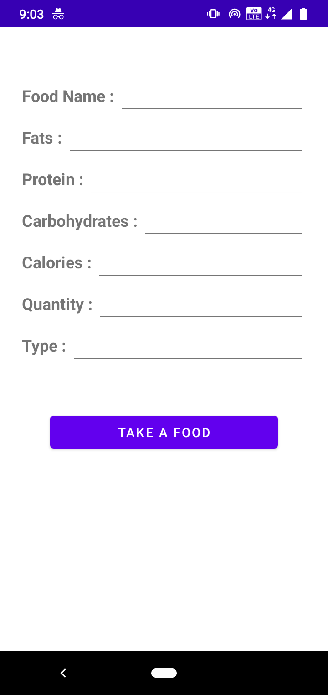
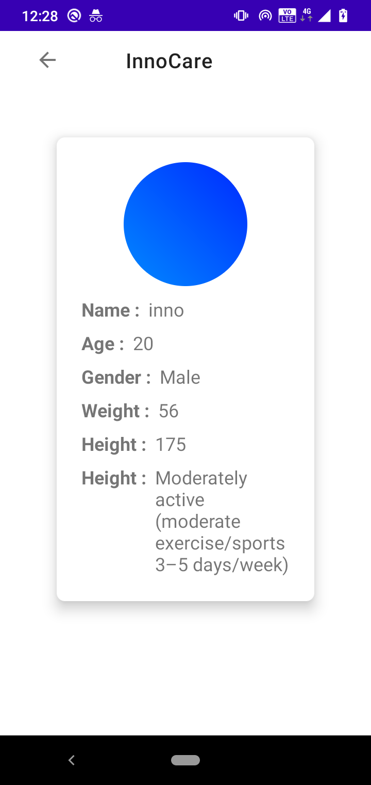

# InnoCare - A Calorie Tracker App
InnoCare is a calorie tracker app that tracks a user’s daily food and calorie intake. 
It uses Firebase, Kotlin Coroutines, Navigation Drawer, Recycler View and much more.

### Features

* Navigation Drawer
* Signup & Signin functionality
* Add food 
* RecyclerView
* CardView

### Screenshots

